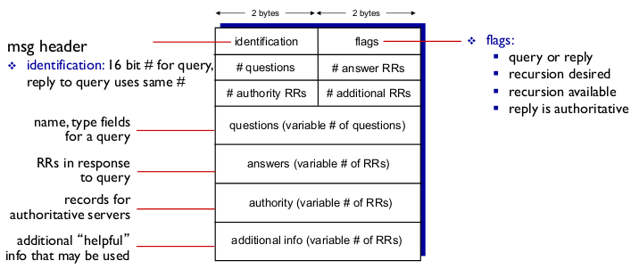
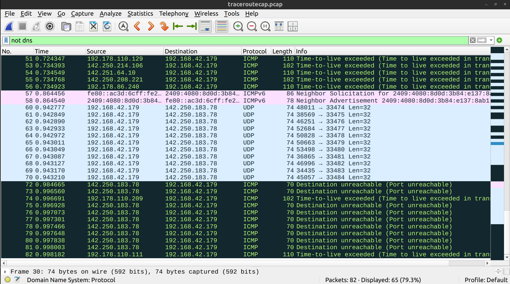
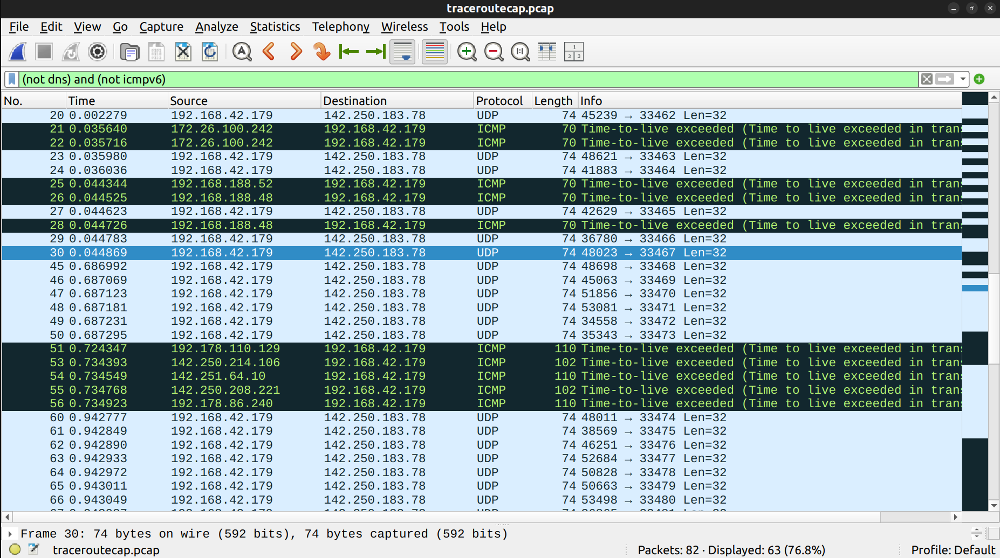
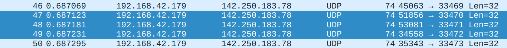
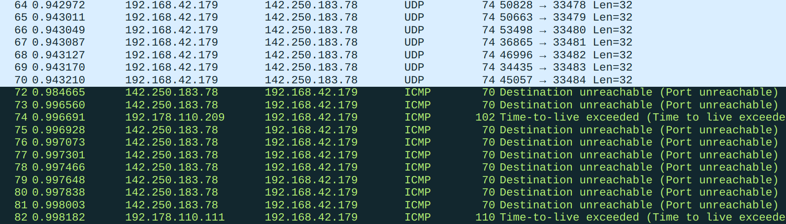
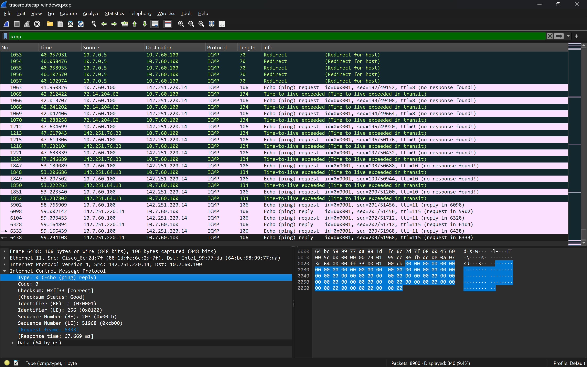
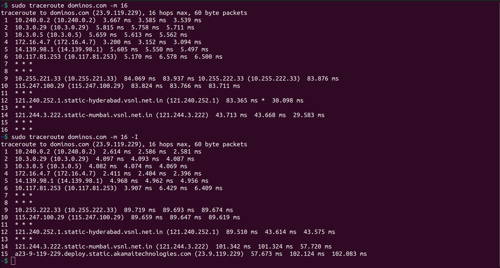
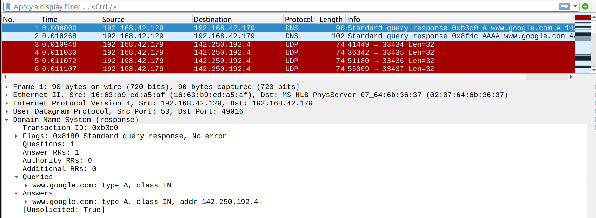
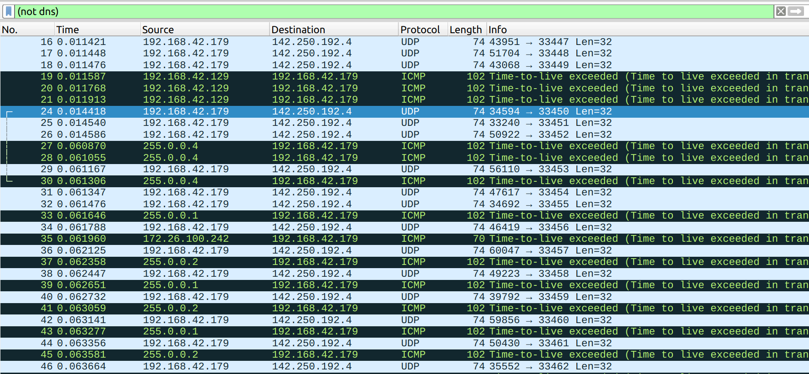

# Team members

| Name | Roll no. |
| ---- | -------- |
| Pranav Joshi | 22110197 |
| Nishit | 22110172 |

# Task 1: Custom DNS Resolver

## Theory

### DNS

The Domain Name System is a distributed database service that maps hostnames (`www.google.com` for example) to IP addresses (`142.251.220.35` for example). The message format for DNS is as follows :



The DNS message payload can be extracted using `pyshark` which is a Python wrapper around TShark, the CLI alternative to the WireShark software. 
Since for this task, we only need to extract the queries, we need to look at bytes 5 and 6 (with 1 based indexing) to get the number of queries/questions, and then extract the questions, starting from byte 13.

For example, this is an DNS message (in hexadecimal, and bytes separated by ':') :

```
00:00:01:00:00:01:00:00:00:00:00:00:07:74:77:69:74:74:65:72:03:63:6f:6d:00:00:01:00:01
```

Here, we have :

| Field | Value (hexadecimal) |
| ----- | ----- |
| Identification | 00 00 |
| Flags | 01 00 |
| no. of questions | 00 01 |
| no. of answers | 00 00 |
| no. of authority RRs | 00 00 |
| no. of additional RRs | 00 00 |
| questions | 07 74 77 69 74 74 65 72 03 63 6f 6d 00 00 01 00 01 |

The number of question is thus 1. 
In the "questions" section, each question is a $(\text{name},\text{type},\text{class})$ tuple. The $\text{name}$ part is encoded by breaking the Fully Qualified Domain Name (FQDN) into its consituent parts (for example, `"twitter.com"` to `["twitter","com"]`) and then encoding each charater in ASCII format (one byte for each character) for each part. For each part, we also add prepend a byte that tells the length. For example, for `"twitter"` the length is 7 and so we prepend the byte `0x07` before the encoded name, namely `74 77 69 74 74 65 72` (hexadecimal). Similarly, for `"com"` , we get length of `0x03` and encoding of `63 6f 6d` . Finally, we put a null character `0x00` signifying the end of the name. After that, the next 2 bytes are the $\text{type}$. In our example, it is `0x0001` (1 in decimal), which is the code for `A` type queries. And then, the last 2 bytes are the $\text{class}$ . In our example, it is `0x0001`, which is the code for `IN` (means "internet").

Since we are asked to only report the custom header, FQDN, and the response from the server, other information, such as $\text{type}$ and $\text{class}$ are not needed to be extracted.

Rather than parsing the bytes myself, I will rely on `pyshark` to do this by default.

But just for the sake of completeness, I'll provide an option (`--parse`) that will parse the DNS message manually and extract the queries.

### Custom header

According to the assignment PDF, the custom header is 

>  A value of the current date-time and id,
use timestamp in format "HHMMSSID" 

This can be interpreted as either the current system time on the client, or the time when the DNS message was originaly sent. The time when DNS message is sent is recorded by WireShark while capturing the packets and can be easiliy extracted by `pyshark`. Since I am unsure what to implement, I will use the current system time on my laptop by default and provide the `--st` option to use the packet sniff time.


## File Structure
- `client.py`: Client-side script for packet parsing and message sending.
- `server.py`: Server-side script for DNS resolution logic.
- `DNSmessages.csv`: Stores extracted DNS queries. This is optional and can be avoided using `--dwem` option for `client.py` .
- `Report.csv`: Records query headers, domains, and resolved IPs.
- `9.pcap` : The PCAP file number should be $(197 + 172) \text{ mod } 10 = 9$. Thus, I should use `9.pcap` for the task.

## Usage

### Prerequisites

- Python 3.x
- `pyshark` library (`pip install pyshark`)
- PCAP file for DNS traffic (see assignment instructions for correct selection)

### Running the Server

```bash
python3 server.py
```

This will start the server on `127.0.0.1:53535`, giving this output:

```
Server listening on 127.0.0.1:53535
```

Ensure the server is running before starting the client.

### Running the Client

```
python3 client.py [OPTIONS] <pcapfiles>
```

You can pass in multiple (space separated) PCAP filenames in place of `<pcapfiles>`.

#### Options:

- `--help`: Show help message and usage instructions.
- `--de`: Skip extraction from PCAP and use previously extracted messages (in `DNSmessages.csv`).
- `--dwem`: Skip writing extracted messages in `DNSmessages.csv`.
- `--tcp`: Uses TCP rather than UDP for transport layer.
- `--parse`: Parses the DNS message without relying on PyShark
- `--st`: Uses packet sniff time rather than the current system time.
- `--batch`: Batches the extraced DNS messages to resolve togather, rather than immediately after extraction (default)

The client parses DNS queries from the PCAP file, adds a header, sends them to the server, and writes the results to `Report.csv`.

### Running the server

```
python3 server.py [--tcp]
```

If the `--tcp` option is set, the server uses TCP to communicate with the client.
When using UDP, there is a thread that waits for the `exit` command on the terminal to gracefully close the server. Pressing `Ctrl`+`C` also exits (for both UDP and TCP modes). 

## Example

On client side we get this: 

```
$ python3 client.py 9.pcap
Packet : 2025-09-11 13:50:22.885383 : UDP 10.240.26.55 → 8.8.8.8 : 00:00:01:0...
Sent 37 bytes to 127.0.0.1:53535
Response: 192.168.1.6
Packet : 2025-09-11 13:50:33.896118 : UDP 10.240.26.55 → 8.8.8.8 : 00:00:01:0...
Sent 37 bytes to 127.0.0.1:53535
Response: 192.168.1.7
Packet : 2025-09-11 13:50:37.059897 : UDP 10.240.26.55 → 8.8.8.8 : 00:00:01:0...
Sent 37 bytes to 127.0.0.1:53535
Response: 192.168.1.8
Packet : 2025-09-11 13:50:45.720688 : UDP 10.240.26.55 → 8.8.8.8 : 00:00:01:0...
Sent 38 bytes to 127.0.0.1:53535
Response: 192.168.1.9
Packet : 2025-09-11 13:50:53.805059 : UDP 10.240.26.55 → 8.8.8.8 : 00:00:01:0...
Sent 36 bytes to 127.0.0.1:53535
Response: 192.168.1.10
Packet : 2025-09-11 13:51:03.031684 : UDP 10.240.26.55 → 8.8.8.8 : 00:00:01:0...
Sent 36 bytes to 127.0.0.1:53535
Response: 192.168.1.6
Extracted DNS queries from PCAP and resolved
```

and on server side :

```
$ python3 server.py
Server listening on 127.0.0.1:53535
Received DNS query from 127.0.0.1:43863
Header extracted :13:50:22:0
IP to return : 192.168.1.6
response sent
Received DNS query from 127.0.0.1:59360
Header extracted :13:50:33:1
IP to return : 192.168.1.7
response sent
Received DNS query from 127.0.0.1:47293
Header extracted :13:50:37:2
IP to return : 192.168.1.8
response sent
Received DNS query from 127.0.0.1:36421
Header extracted :13:50:45:3
IP to return : 192.168.1.9
response sent
Received DNS query from 127.0.0.1:39677
Header extracted :13:50:53:4
IP to return : 192.168.1.10
response sent
Received DNS query from 127.0.0.1:43491
Header extracted :13:51:03:5
IP to return : 192.168.1.6
response sent
exit
Shutting down server...
```

The output (in `Report.csv`) will be:

| Custom header value (HHMMSSID)   | Domain name   | Resolved IP address   |
| -------------------------------- | ------------- | --------------------- |
| 13502200                         | twitter.com   | 192.168.1.6           |
| 13503301                         | example.com   | 192.168.1.7           |
| 13503702                         | netflix.com   | 192.168.1.8           |
| 13504503                         | linkedin.com  | 192.168.1.9           |
| 13505304                         | reddit.com    | 192.168.1.10          |
| 13510305                         | openai.com    | 192.168.1.6           |

### Output Files

- `DNSmessages.csv`: Extracted DNS queries from the PCAP (for inspection).
- `Report.csv`: Table of each query, header, and resolved IP (for submission).

<div style="page-break-after: always;"></div>

# Task 2: Traceroute on different OS

## Theory

### `traceroute`

According to the manual page for `traceroute 2.1.0`, the way this utility measures the Round-Trip-Time (RTT) for each node in the path to a particular destination host is by sending probing packets (with various transport and network layer protocols) with small time-to-live (TTL) values. It starts with a TTL value of 1 and increases upto `max_ttl` which is set to 30 by default. For every TTL value, it sends 3 probe packets. For every packet that exceeds the number of hops (the TTL value) while moving towards the destination, the router which last decremented its TTL value (before it reaching 0) sends back an ICMP packet that reports this event. The time taken for this packet to reach, starting from the time that the probe packet was sent is the RTT for that node, whose IP address is there in said ICMP packet.

### `tcpdump`

Now, `tcpdump` is an utility that allows capturing the packets sent to your device. Since I am connected to the internet through an ethernet connection with my smartphone (using USB), which is further connected to the internet using cellular data, my laptop won't be getting any other traffic. 
Now, I will run `tcpdump` in th background as `sudo tcpdump -i enx0207646b3637 -w traceroutecap.pcap &` . Here, `enx0207646b3637` is the USB ethernet interface and `traceroutecap.pcap` is the name of the output file where the capture/dump will be written.
To kill this `tcpdump` process later, I will store the process ID as `TCPDUMP_PID=$!`.
Then, I will run `traceroute` and later kill the `tcpdump` process using `sudo kill $TCPDUMP_PID` .
Note that my smartphone's IPv4 address is `49.34.205.233` and my laptop's IPv4 address is `192.168.42.179` . This will come in handy later. This modification is harmless to our analysis as I'll show later (after answering the questions).

## Execution

What I really want to run is `traceroute google.com`, but I don't want to deal with the packets involved in the DNS lookup for `google.com`. So, I will instead, use the IPv4 address `142.250.183.78`. This is one of Google's servers.

I got the IPv4 address using `nslookup`.

```
~$ nslookup google.com
Server:		127.0.0.53
Address:	127.0.0.53#53

Non-authoritative answer:
Name:	google.com
Address: 142.250.183.78
Name:	google.com
Address: 2404:6800:4009:821::200e
```

Note that Google uses load balancing and the output for `nslookup` is not constant. 
The final script for the capture is :

```bash
sudo tcpdump -i enx0207646b3637 -w traceroutecap.pcap &
TCPDUMP_PID=$!
traceroute 142.250.183.78
sudo kill $TCPDUMP_PID
```

The output of `traceroute` is :

```
traceroute to 142.250.183.78 (142.250.183.78), 30 hops max, 60 byte packets
 1  _gateway (192.168.42.129)  0.729 ms  0.829 ms  0.922 mstcpdump: listening on enx0207646b3637, link-type EN10MB (Ethernet), snapshot length 262144 bytes

 2  * * *
 3  255.0.0.1 (255.0.0.1)  67.427 ms  68.297 ms  68.819 ms
 4  255.0.0.2 (255.0.0.2)  67.964 ms  67.621 ms  68.389 ms
 5  * * *
 6  255.0.0.4 (255.0.0.4)  66.334 ms  63.343 ms  63.366 ms
 7  172.26.100.243 (172.26.100.243)  62.935 ms 172.26.100.242 (172.26.100.242)  35.445 ms  35.421 ms
 8  192.168.188.52 (192.168.188.52)  43.909 ms 192.168.188.48 (192.168.188.48)  43.917 ms  43.929 ms
 9  * * *
10  * * *
11  * * *
12  * 192.178.110.129 (192.178.110.129)  37.376 ms *
13  192.178.86.240 (192.178.86.240)  47.810 ms 142.250.214.106 (142.250.214.106)  47.222 ms 142.251.64.10 (142.251.64.10)  47.328 ms
14  142.250.208.221 (142.250.208.221)  47.485 ms bom12s12-in-f14.1e100.net (142.250.183.78)  41.922 ms  53.722 ms
82 packets captured
94 packets received by filter
0 packets dropped by kernel
```

We can do a similar execution of `tracert` (on Windows) :

```
C:\Users\ASUS> nslookup google.com
Server:  dns-prod.skylus.lan
Address:  10.0.136.7

Non-authoritative answer:
Name:    google.com
Addresses:  2404:6800:4009:80c::200e
          142.251.220.14


C:\Users\ASUS> tracert 142.251.220.14

Tracing route to hkg07s49-in-f14.1e100.net [142.251.220.14]
over a maximum of 30 hops:

  1     2 ms     1 ms     1 ms  10.7.0.5
  2    43 ms     8 ms     1 ms  172.16.4.7
  3     5 ms     3 ms     3 ms  14.139.98.1
  4    16 ms     1 ms    15 ms  10.117.81.253
  5    12 ms    12 ms    12 ms  10.154.8.137
  6    13 ms    10 ms    12 ms  10.255.239.170
  7    10 ms    52 ms    76 ms  10.152.7.214
  8    61 ms    27 ms    46 ms  72.14.204.62
  9    13 ms    13 ms    13 ms  142.251.76.33
 10    18 ms    14 ms    14 ms  142.251.64.13
 11   236 ms   162 ms    68 ms  hkg07s49-in-f14.1e100.net [142.251.220.14]

Trace complete.
```

Now, the PCAP file (for Linux `traceroute` execution) can be analysed in WireShark. 


Notice that the size of the frame is 60 bytes, just as displayed by `traceroute` .
The initial few UDP and ICMP packets are for the Enthernet connection (interface `enx0207646b3637`) through USB to my smartphone.


Since each packet is being sent through this, it also follows the Ethernet II protocol.

Also notice that although we tried to remove the DNS lookups for `google.com` , there are still some other DNS lookups. Since the probe packets do not follow the DNS message format, we can simply remove the DNS related packets and only focus on the UDP and ICMP/ICMPv6 packets . This can be done using the filter `not dns` in WireShark.



Even the `ICMPv6` packets are not relevant since they are not signifying either TTL reaching 0 or the port being inactive on the destination.

So, we can filter them out too using `(not dns) and (not icmpv6)` as the filter.



This leaves us with only 63 packets out of the original 82 captured.

<div style="page-break-after: always;"></div>

## Questions

### Question 1 
What protocol does Windows tracert use by default, and what protocol does Linux
traceroute use by default?

---

On Linux, the protocol that is used by default for the probe packets is UDP. This is evident from the screenshots of the packets analysed on WireShark for Linux. 

But this is only a default settings. We can explicitely state the protocol to use, using `-I` for ICMP, `-T` for TCP SYN packets as probes and `-U` for UDP. There are other protocols too, such as layer-four-TCP (`lft`) and raw IP datagrams.

For Windows `tracert`, the protocol is ICMP Echo/Ping request by default. For example, in the capture `traceroutecap_windows.pcap` :


From the [page]((https://learn.microsoft.com/en-us/windows-server/administration/windows-commands/tracert)) for `tracert` on Microsoft Learn :

> tracert- this diagnostic tool determines the path taken to a destination by sending Internet Control Message Protocol (ICMP) echo Request or ICMPv6 messages to the destination with incrementally increasing time to live (TTL) field values

---

<div style="page-break-after: always;"></div>

### Question 2
Some hops in your traceroute output may show ***. Provide at least two reasons
why a router might not reply.

---

According to the manual page for `traceroute` :

> If there is no response within a certain timeout, an "*" (asterisk) is printed for that probe.

This timeout could happen due to various reasons, such as 

- the probe packet being lost (in case of UDP probes for example)
- the Round-Trip-Time being too large for that router/host.
- A firewall preventing the host from responding to UDP packets.
  For example, one such firewall exists for `dominos.com`. This is talked about in detail in the answer for Q5.
- A router not sending ICMP (time to live exceeded) responses for messages that reach TTL value of 0 when being processed by it. In such a case, the probes for the corresponding initial TTL will not get a response, but ones after them may still get responses since those responses will be generated by different routers or the destination end-system.

---

<div style="page-break-after: always;"></div>

### Question 3 

In Linux traceroute, which field in the probe packets changes between successive
probes sent to the destination?

---

The source and destination port numbers.
Consider these highlighted packets :



In the first highlighted packet, 51856 is the value of the source port number field in the UDP datagram/segment and 33470 is the value for destination port number. All these three highlighted packets had a TTL of 13 as you can see from these three screenshots :


---

<div style="page-break-after: always;"></div>

### Question 4
At the final hop, how is the response different compared to the intermediate hop?

----

In the final hop, the response indicates an unreachable port rather than the TTL value reaching 0 (for the packet, as it hops). This is explicitely stated in the manual page for `traceroute` :

>We start our probes with a ttl of one and in‐
crease  by  one  until we get an ICMP "port unreachable" (or TCP reset)

For the packets I captured, this shows for the packets at the very end :



On the other hand, for an intermediate hop, the expected response (for Linux) is an ICMP packet saying "time to live exceeded".

On Windows, the expected type of response from the destination end-system is an ICMP echo reply.



---

<div style="page-break-after: always;"></div>

### Question 5
Suppose a firewall blocks UDP traffic but allows ICMP — how would this affect the
results of Linux traceroute vs. Windows tracert?

----

Many ISPs and CDNs (like Akamai, which serves `dominos.com`) configure intermediate routers to ignore ICMP Echo Requests or rate-limit ICMP responses. This prevents their infrastructure from being overloaded by diagnostic tools like `traceroute`/`ping` .
Let's take the example of `dominos.com` .



As you can see from this execution of `traceroute`, the UDP probes are unable to reach the final destination (as indicated by the astericks for TTL values 15 and 16), but the ICMP probes are. 

Since `tracert` on Windows uses ICMP probes by default, the probes aren't dropped pre-maturely and are eventually able to reach the destination (as TTL is increased).

```
PS C:\Users\ASUS> tracert dominos.com

Tracing route to a23-9-119-229.deploy.static.akamaitechnologies.com [23.9.119.229]
over a maximum of 30 hops:

  1     3 ms     2 ms     2 ms  10.27.13.154
  2    29 ms     5 ms     6 ms  10.7.0.5
  3    22 ms    10 ms    10 ms  172.16.4.7
  4    38 ms     7 ms     8 ms  14.139.98.1
  5    43 ms     6 ms     6 ms  10.117.81.253
  6     *        *        *     Request timed out.
  7     *        *        *     Request timed out.
  8    47 ms    34 ms    39 ms  10.255.222.33
  9    62 ms    36 ms    35 ms  115.247.100.29
 10     *        *        *     Request timed out.
 11    61 ms    35 ms    40 ms  121.240.252.1.static-hyderabad.vsnl.net.in [121.240.252.1]
 12     *        *        *     Request timed out.
 13   167 ms    84 ms    42 ms  121.244.3.222.static-mumbai.vsnl.net.in [121.244.3.222]
 14    70 ms    32 ms    32 ms  a23-9-119-229.deploy.static.akamaitechnologies.com [23.9.119.229]

Trace complete.
```

----

### Does using IP address for `traceroute` make a difference ?

Now, since doing this for one of the servers that `google.com` may resolve to may not be satisfactory for whoever is going to grade this assignment, I will _also_ capture the packets for `traceroute google.com` and show the differences.

The script will be the same as before, but with `www.google.com` instead of `142.251.220.14`.

The output of `traceroute` is :


For better visibility, this is the output in text :

```
tcpdump: listening on enx0207646b3637, link-type EN10MB (Ethernet), snapshot length 262144 bytes
traceroute to www.google.com (142.250.192.4), 30 hops max, 60 byte packets
 1  _gateway (192.168.42.129)  0.671 ms  0.767 ms  0.851 ms
 2  * * *
 3  255.0.0.1 (255.0.0.1)  50.453 ms  51.420 ms  52.011 ms
 4  255.0.0.2 (255.0.0.2)  51.062 ms  51.730 ms  52.224 ms
 5  * * *
 6  255.0.0.4 (255.0.0.4)  49.586 ms  46.914 ms  46.343 ms
 7  172.26.100.242 (172.26.100.242)  47.384 ms 172.26.100.243 (172.26.100.243)  28.715 ms 172.26.100.242 (172.26.100.242)  28.697 ms
 8  192.168.188.50 (192.168.188.50)  39.180 ms 192.168.188.48 (192.168.188.48)  39.082 ms  38.972 ms
 9  * * *
10  * * *
11  173.194.121.8 (173.194.121.8)  49.866 ms * *
12  192.178.110.227 (192.178.110.227)  39.026 ms * *
13  142.250.208.223 (142.250.208.223)  61.612 ms 216.239.46.136 (216.239.46.136)  72.893 ms 216.239.50.166 (216.239.50.166)  73.304 ms
14  142.250.208.223 (142.250.208.223)  73.019 ms 192.178.110.248 (192.178.110.248)  73.582 ms 108.170.231.79 (108.170.231.79)  73.347 ms
15  bom12s14-in-f4.1e100.net (142.250.192.4)  37.230 ms  40.752 ms 192.178.110.205 (192.178.110.205)  40.848 ms
129 packets captured
130 packets received by filter
0 packets dropped by kernel
```

When analysed in WireShark, without any filters, we get this :



As you can see, before sending probes to `www.google.com`, we first need to do a DNS lookup.

The IP address returned is `142.250.192.4` which is different from what we got earlier from `nslookup`. This is because of load distribution/balancing over the servers.

There were also no `ICMPv6` responses when using `google.com` directly.

Apart from that, there were no major differences.


