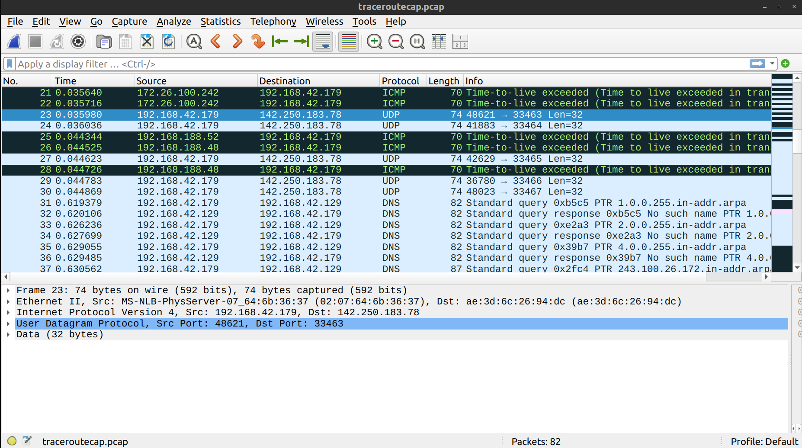
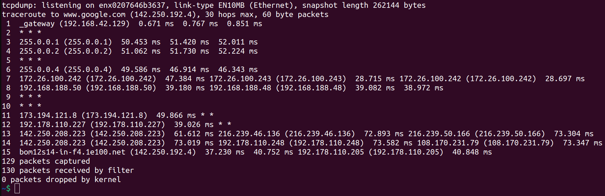

# Team members

| Name | Roll no. |
| ---- | -------- |
| Pranav Joshi | 22110197 |
| Neeshit | 22110172 |

# Task 1: Custom DNS Resolver

The PCAP file number should be $(197 + 172) \text{ mod } 10 = 9$. Thus, I should use `9.pcap` for the report.

## File Structure
- `client.py`: Client-side script for packet parsing and message sending.
- `server.py`: Server-side script for DNS resolution logic.
- `DNSmessages.csv`: Stores extracted DNS queries. This is optional and can be avoided using `--dwem` option for `client.py` .
- `Report.csv`: Records query headers, domains, and resolved IPs.

## Usage

### Prerequisites

- Python 3.x
- `pyshark` library (`pip install pyshark`)
- PCAP file for DNS traffic (see assignment instructions for correct selection)

### Running the Server

```bash
python3 server.py
```

This will start the server on `127.0.0.1:5353`, giving this output:

```
Server listening on 127.0.0.1:5353
```

Ensure the server is running before starting the client.

### Running the Client

```
python3 client.py [OPTIONS] <pcapfile>
```

#### Options:

- `--help`: Show help message and usage instructions.
- `--de`: Skip extraction from PCAP and use previously extracted messages (in `DNSmessages.csv`).
- `--dwem`: Skip writing extracted messages in `DNSmessages.csv`.

The client parses DNS queries from the PCAP file, adds a header, sends them to the server, and writes the results to `Report.csv`.

For example, on client side we get this: 

```
$ python3 client.py 9.pcap
2025-09-04 18:04:16.129282 : UDP 10.240.26.55 → 8.8.8.8 : 00:00:01:0...
2025-09-04 18:04:16.129867 : UDP 10.240.26.55 → 8.8.8.8 : 00:00:01:0...
2025-09-04 18:04:16.129593 : UDP 10.240.26.55 → 8.8.8.8 : 00:00:01:0...
2025-09-04 18:04:16.129442 : UDP 10.240.26.55 → 8.8.8.8 : 00:00:01:0...
2025-09-04 18:04:16.129997 : UDP 10.240.26.55 → 8.8.8.8 : 00:00:01:0...
2025-09-04 18:04:16.129735 : UDP 10.240.26.55 → 8.8.8.8 : 00:00:01:0...
Extracted!
Sent 37 bytes to 127.0.0.1:5353
Response: 192.168.1.6
Sent 37 bytes to 127.0.0.1:5353
Response: 192.168.1.7
Sent 37 bytes to 127.0.0.1:5353
Response: 192.168.1.8
Sent 38 bytes to 127.0.0.1:5353
Response: 192.168.1.9
Sent 36 bytes to 127.0.0.1:5353
Response: 192.168.1.10
Sent 36 bytes to 127.0.0.1:5353
Response: 192.168.1.6
```

and on server side :

```
TCP connection established with 127.0.0.1:55674
Received DNS query (37 bytes)
Header extracted :18:04:16:0
IP to return : 192.168.1.6
response sent
Received DNS query (37 bytes)
Header extracted :18:04:16:1
IP to return : 192.168.1.7
response sent
Received DNS query (37 bytes)
Header extracted :18:04:16:2
IP to return : 192.168.1.8
response sent
Received DNS query (38 bytes)
Header extracted :18:04:16:3
IP to return : 192.168.1.9
response sent
Received DNS query (36 bytes)
Header extracted :18:04:16:4
IP to return : 192.168.1.10
response sent
Received DNS query (36 bytes)
Header extracted :18:04:16:5
IP to return : 192.168.1.6
response sent
Terminated connection from 127.0.0.1:55674
Server listening on 127.0.0.1:5353
```

The output (in `Report.csv`) will be:

| Custom header value (HHMMSSID)   | Domain name   | Resolved IP address   |
| -------------------------------- | ------------- | --------------------- |
| 18041600                         | twitter.com   | 192.168.1.6           |
| 18041601                         | example.com   | 192.168.1.7           |
| 18041602                         | netflix.com   | 192.168.1.8           |
| 18041603                         | linkedin.com  | 192.168.1.9           |
| 18041604                         | reddit.com    | 192.168.1.10          |
| 18041605                         | openai.com    | 192.168.1.6           |

### Output Files

- `DNSmessages.csv`: Extracted DNS queries from the PCAP (for inspection).
- `Report.csv`: Table of each query, header, and resolved IP (for submission).

# Task 2: Traceroute on different OS

According to the manual page for `traceroute 2.1.0`, the way this utility measures the Round-Trip-Time (RTT) for each node in the path to a particular destination host is by sending probing packets (with various transport and network layer protocols) with small time-to-live (TTL) values. It starts with a TTL value of 1 and increases upto `max_ttl` which is set to 30 by default. For every TTL value, it sends 3 probe packets. For every packet that exceeds the number of hops (the TTL value) while moving towards the destination, the router which last decremented its TTL value (before it reaching 0) sends back an ICMP packet that reports this event. The time taken for this packet to reach, starting from the time that the probe packet was sent is the RTT for that node, whose IP address is there in said ICMP packet.

Now, `tcpdump` is an utility that allows capturing the packets sent to your device. Since I am connected to the internet through an ethernet connection with my smartphone (using USB), which is further connected to the internet using cellular data, my laptop won't be getting any other traffic. 
Now, I will run `tcpdump` in th background as `sudo tcpdump -i enx0207646b3637 -w traceroutecap.pcap &` . Here, `enx0207646b3637` is the USB ethernet interface and `traceroutecap.pcap` is the name of the output file where the capture/dump will be written.
To kill this `tcpdump` process later, I will store the process ID as `TCPDUMP_PID=$!`.
Then, I will run `traceroute` and later kill the `tcpdump` process using `sudo kill $TCPDUMP_PID` .
Note that my smartphone's IPv4 address is `49.34.205.233` and my laptop's IPv4 address is `192.168.42.179` . This will come in handy later. This modification is harmless to our analysis as I'll show later (after answering the questions).

Now, what I really want to run is `traceroute google.com`, but I don't want to deal with the packets involved in the DNS lookup for `google.com`. So, I will instead, use the IPv4 address `142.250.183.78`. This is one of Google's servers.

I got the IPv4 address using `nslookup`.

```
~$ nslookup google.com
Server:		127.0.0.53
Address:	127.0.0.53#53

Non-authoritative answer:
Name:	google.com
Address: 142.250.183.78
Name:	google.com
Address: 2404:6800:4009:821::200e
```

Note that Google uses load balancing and the output for `nslookup` is not constant. 
The final script for the capture is :

```bash
sudo tcpdump -i enx0207646b3637 -w traceroutecap.pcap &
TCPDUMP_PID=$!
traceroute 142.250.183.78
sudo kill $TCPDUMP_PID
```

The output of `traceroute` is :

```
traceroute to 142.250.183.78 (142.250.183.78), 30 hops max, 60 byte packets
 1  _gateway (192.168.42.129)  0.729 ms  0.829 ms  0.922 mstcpdump: listening on enx0207646b3637, link-type EN10MB (Ethernet), snapshot length 262144 bytes

 2  * * *
 3  255.0.0.1 (255.0.0.1)  67.427 ms  68.297 ms  68.819 ms
 4  255.0.0.2 (255.0.0.2)  67.964 ms  67.621 ms  68.389 ms
 5  * * *
 6  255.0.0.4 (255.0.0.4)  66.334 ms  63.343 ms  63.366 ms
 7  172.26.100.243 (172.26.100.243)  62.935 ms 172.26.100.242 (172.26.100.242)  35.445 ms  35.421 ms
 8  192.168.188.52 (192.168.188.52)  43.909 ms 192.168.188.48 (192.168.188.48)  43.917 ms  43.929 ms
 9  * * *
10  * * *
11  * * *
12  * 192.178.110.129 (192.178.110.129)  37.376 ms *
13  192.178.86.240 (192.178.86.240)  47.810 ms 142.250.214.106 (142.250.214.106)  47.222 ms 142.251.64.10 (142.251.64.10)  47.328 ms
14  142.250.208.221 (142.250.208.221)  47.485 ms bom12s12-in-f14.1e100.net (142.250.183.78)  41.922 ms  53.722 ms
82 packets captured
94 packets received by filter
0 packets dropped by kernel
```

Now, the PCAP file can be analysed in WireShark. 


Notice that the size of the frame is 60 bytes, just as displayed by `traceroute` .
The initial few UDP and ICMP packets are for the Enthernet connection (interface `enx0207646b3637`) through USB to my smartphone.



Since each packet is being sent through this, it also follows the Ethernet II protocol.

Also notice that although we tried to remove the DNS lookups for `google.com` , there are still some other DNS lookups. Since the probe packets do not follow the DNS message format, we can simply remove the DNS related packets and only focus on the UDP and ICMP/ICMPv6 packets . This can be done using the filter `not dns` in WireShark.


Even the `ICMPv6` packets are not relevant since they are not signifying either TTL reaching 0 or the port being inactive on the destination.

So, we can filter them out too using `(not dns) and (not icmpv6)` as he filter.


This leaves us with only 63 packets out of the original 82 captured.

Now, we are ready to answer the questions.

### Question 1 
What protocol does Windows tracert use by default, and what protocol does Linux
traceroute use by default?

---

On Linux, the protocol that is used by default is UDP. This is evident from the screenshots of the packets analysed on WireShark. On Windows, the protocol is ICMP by default, according to the manual page. But these are only the default settings. We can explicitely state the protocol to use, using `-I` for ICMP, `-T` for TCP SYN packets as probes and `-U` for UDP. There are other protocols too, such as layer-four-TCP (`lft`) and raw IP datagrams.

---

### Question 2
Some hops in your traceroute output may show ***. Provide at least two reasons
why a router might not reply.

---

According to the manual page for `traceroute` :
> If there is no response within a certain timeout, an "*" (asterisk) is printed for that probe.
This timeout could happen due to various reasons, such as 
- the probe packet being lost (in case of UDP probes for example)
- the Round-Trip-Time being too large for that router/host.
- A firewall preventing the host from responding to UDP packets.
  For example, one such firewall exists for `dominos.com`. This is talked about in detail in the answer for Q5.

---

### Question 3 

In Linux traceroute, which field in the probe packets changes between successive
probes sent to the destination?

---

The source and destination port numbers.
Consider these highlighted packets :


In the first highlighted packet, 51856 is the value of the source port number field in the UDP datagram/segment and 33470 is the value for destination port number. All these three highlighted packets had a TTL of 13 as you can see from this picture.

<table><tr>
<td></td>
<td></td>
<td></td>
</tr></table>

---

### Question 4
At the final hop, how is the response different compared to the intermediate hop?

----

In the final hop, the response indicates an unreachable port rather than the TTL value reaching 0 (for the packet, as it hops). This is explicitely stated in the manual page :

>We start our probes with a ttl of one and in‐
crease  by  one  until we get an ICMP "port unreachable" (or TCP reset)

For the packets I captured, this shows for the packets at the very end :


On the other hand, for an intermediate hop, the expected response (for Linux) is an ICMP packet saying "time to live exceeded".

---

### Question 5
Suppose a firewall blocks UDP traffic but allows ICMP — how would this affect the
results of Linux traceroute vs. Windows tracert?

----

Let's take the example of `dominos.com` .

As you can see from this execution of `traceroute`, the UDP probes are unable to reach the final destination (as indicated by the astericks for TTL values 15 and 16), but the ICMP probes are. Since `tracert` on Windows uses ICMP probes by default, it will be able to measure the RTT for each node in the full path, including the destination host; without the need for any extra modifications (such as the `-I` option being set).

----

### Does using IP address for `traceroute` make a difference ?

Now, since doing this for one of the servers that `google.com` may resolve to may not be satisfactory for whoever is going to grade this assignment, I will _also_ capture the packets for `traceroute google.com` and show the differences.

The script will be the same as before, but with `www.google.com` instead of `142.251.220.14`.

The output of `traceroute` is :



For better visibility, this is the output in text :

```
tcpdump: listening on enx0207646b3637, link-type EN10MB (Ethernet), snapshot length 262144 bytes
traceroute to www.google.com (142.250.192.4), 30 hops max, 60 byte packets
 1  _gateway (192.168.42.129)  0.671 ms  0.767 ms  0.851 ms
 2  * * *
 3  255.0.0.1 (255.0.0.1)  50.453 ms  51.420 ms  52.011 ms
 4  255.0.0.2 (255.0.0.2)  51.062 ms  51.730 ms  52.224 ms
 5  * * *
 6  255.0.0.4 (255.0.0.4)  49.586 ms  46.914 ms  46.343 ms
 7  172.26.100.242 (172.26.100.242)  47.384 ms 172.26.100.243 (172.26.100.243)  28.715 ms 172.26.100.242 (172.26.100.242)  28.697 ms
 8  192.168.188.50 (192.168.188.50)  39.180 ms 192.168.188.48 (192.168.188.48)  39.082 ms  38.972 ms
 9  * * *
10  * * *
11  173.194.121.8 (173.194.121.8)  49.866 ms * *
12  192.178.110.227 (192.178.110.227)  39.026 ms * *
13  142.250.208.223 (142.250.208.223)  61.612 ms 216.239.46.136 (216.239.46.136)  72.893 ms 216.239.50.166 (216.239.50.166)  73.304 ms
14  142.250.208.223 (142.250.208.223)  73.019 ms 192.178.110.248 (192.178.110.248)  73.582 ms 108.170.231.79 (108.170.231.79)  73.347 ms
15  bom12s14-in-f4.1e100.net (142.250.192.4)  37.230 ms  40.752 ms 192.178.110.205 (192.178.110.205)  40.848 ms
129 packets captured
130 packets received by filter
0 packets dropped by kernel
```

When analysed in WireShark, without any filters, we get this :


As you can see, before sending probes to `www.google.com`, we fist need to do a DNS lookup.

The IP address returned is `142.250.192.4` which is different from what we got earlier from `nslookup`. This is because of load distribution/balancing over the servers.

There were also no `ICMPv6` responses when using `google.com` directly.

Apart from that, there were no major differences.

